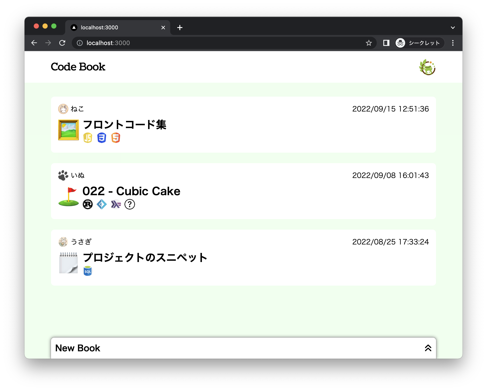

# Code Book ( ver 2 )

React / Next 勉強用リポジトリ

## サービス概要
- Gist と Qiita と Zenn を混ぜたようなもの
- Book を作って Code を保存できる
    - Code はファイル形式・URL 形式・スニペット形式がある
- Code にコメントを付けられる

## 構成
- [frontend](./front/code-book) は Next.js
- [backend](./back/code-book) は Spring Boot
- Docker 利用なし、ローカル開発環境のみ

## バージョン
作り直すたびにバージョン ( `ver x` ) を上げる

