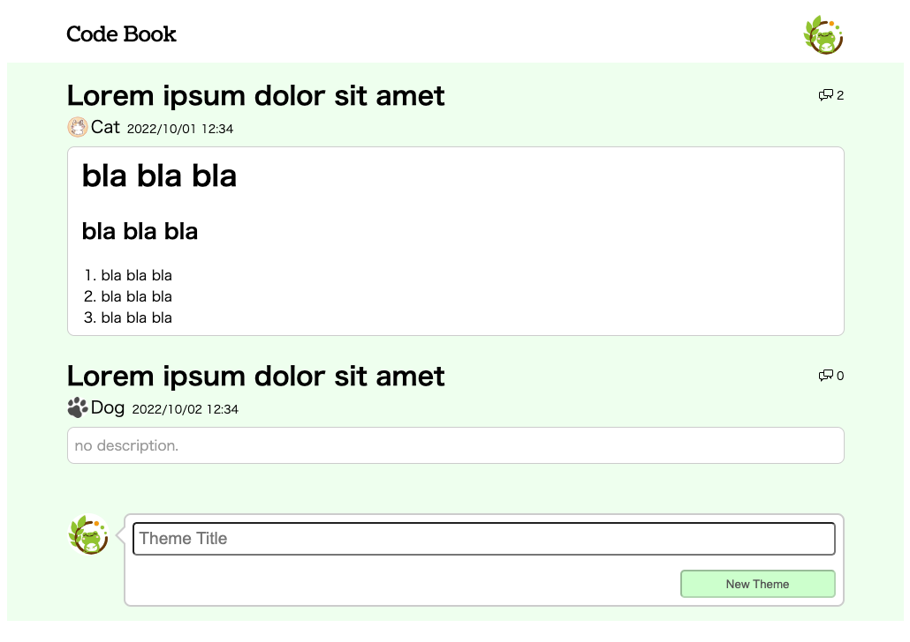
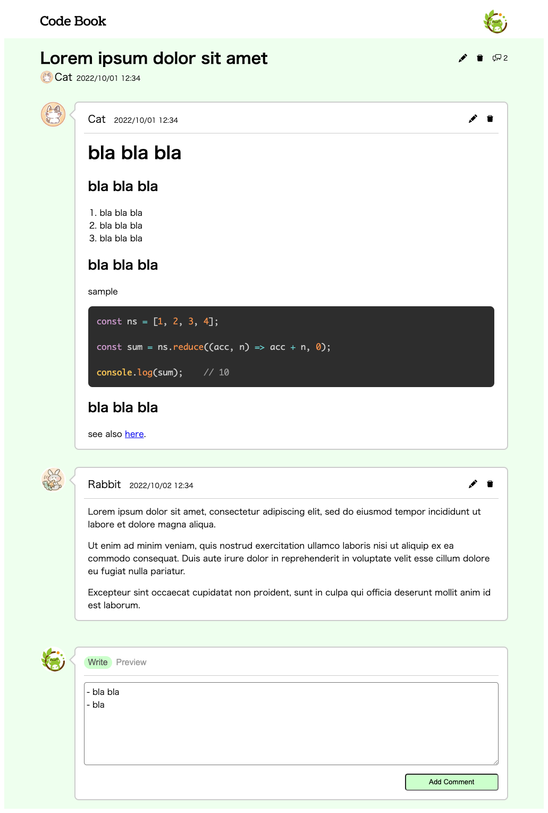

# Code Book ( ver 3 )

React / Next 勉強用リポジトリ

### お題一覧

### お題に対する回答と議論

## サービス概要
- ほぼ Gist
- Theme を作りお題を出し、Comment で回答したりディスカッションしたりする
- ver 2 より仕様を大幅カット

## 構成
- Frontend Backend ともに Next.js → [trpc](./trpc)
- Docker 利用なし、ローカル開発環境のみ

## バージョン
作り直すたびにバージョン ( `ver x` ) を上げる

以下 Summary

### ver 1
https://github.com/suzuki-hoge/code-book/tree/5ac238ed26a6ddebba0e46d13749be31b085363b

やったこと

- コンポーネントの作成

技術要素

- StoryBook
- Atmic Design
- styled-components

### ver 2
https://github.com/suzuki-hoge/code-book/tree/01d7bf0c1819127b21a6c41d4177c6bb4ecfb532

やったこと

- `pages/` の実装と `<Link>` の設定
- バックエンドサーバの実装と呼び出し

技術要素

- StoryBook
- Atmic Design
- styled-components
- React Query
- React Hook Form, Yup
- Spring Boot

### ver 3
https://github.com/suzuki-hoge/code-book/tree/master

やったこと

- `pages/` の実装と `<Link>` の設定
- バックエンドサーバの実装と呼び出し

技術要素

- StoryBook
- Atmic Design
- scss modules
- tRPC
- better-sqlite3

